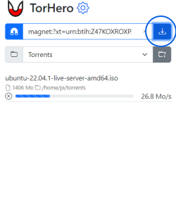
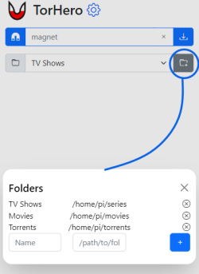
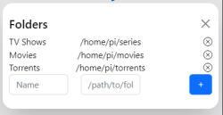

#  TorHero
Mobile-first and WebUI minimalist seedbox server to download torrent (magnets only). Based on [❤ webtorrent](https://webtorrent.io/). *(no other BitTorrent client required)*

| Download Magnet | Add Folder |
| --- | --- |
|  |  |
---
## Install
```bash
npm install -g torhero
```
---
## Start the server
```bash
torhero
```
By default, the port is 8000. You can change that with
```bash
torhero -p 1234
```
You can keep the server running by using [PM2](https://pm2.keymetrics.io/)
```bash
# Stop your torhero server first (Ctrl+C)
npm install pm2 -g
pm2 start torhero
```
---
## WebUI - First use
1. Add a folder
    1. Click on this button 
    2. Choose a Name and set the complete root path to the folder
    ```bash
    # Examples
    C:/Users/pi/torrents # For Windows
    /home/pi/torrents # For Linux
    ```

    
2. Start download
    1. Copy a magnet link into the field
    2. Click on the download button on the left

## Other features
### Password protection
You can use a rudimentary password protection. To encrypt your password use any bcrypt encryption tool online. Then, to access to the server, the url is http://torhero_url/?pwd=mypassword
```bash
torhero -auth 'bcrypt-encrypted-password'
#For example
torhero -auth '$2a$12$rdJX3qYiA6L9epeoZ8K6SundSiC8wCjP45nahMsPWj6YcyHDt8S2m' #Password here is "abcdef"
#http://localhost:8000/?pwd=abcdef
```
### Stop download
You can remove the torrent during it's downloading.

**Important**: It will NOT remove the files
### Provide a folder configuration file
You can provide a json file containing folders' names and path by using this command. By default, a folders.json file is created inside the script folder.
```bash
torhero -folders path/to/folders.json
```
For example, inside folders.json
```json
{
    "Torrents":"/home/pi/torrents"
}
```
**Important**: you should have read/write access to this file
### Magnet scheme/protocol handler
You can set TorHero as your default handler for *magnet:* links. To do so, just click on the gear on top to open the Config dialog.

**Important**: your torhero server must run on local or https server.
### Https server
You can start torhero as a https server. You only need to provide an SSL key and certificate. You can use [mkcert](https://github.com/FiloSottile/mkcert) to create those files. As mentionned, it will allow you to open *magnet:* links with torhero.
```bash
torhero -s -k path/to/key -c path/to/certificate
```